# 1. Problema

O item de estudo é o estágio de saída de um estimulador elétrico funcional (FES) baseado em uma fonte de corrente Howland. Mais especificamente, trata-se do eletroestimulador STIMGRASP, desenvolvido por Renato Barelli em 2017 como parte de uma dissertação de mestrado.

Na dissertação de Renato Barelli, a arquitetura é apresentada e a linearidade do estágio de saída é afirmada como característica esperada do circuito, mas não é feita uma caracterização experimental quantitativa dessa linearidade. Também não são avaliadas, de forma sistemática, a dependência da corrente em relação à carga conectada nem os limites de operação em tensão impostos pela arquitetura.

Nesta arquitetura, o microcontrolador define uma tensão de controle no DAC, e essa tensão deve produzir uma corrente de saída previsível no paciente ou em uma carga equivalente.

O problema central é que o circuito opera em malha aberta: o microcontrolador não mede a corrente real entregue durante a operação. Assim, se a carga mudar, se o contato eletrodo-pele piorar ou se o circuito atingir seu limite de tensão de operação (voltage compliance), a corrente entregue pode deixar de seguir o valor esperado. Como não há realimentação de corrente, essa perda de previsibilidade não é detectada diretamente pelo firmware do STIMGRASP.

Por isso, é necessário caracterizar experimentalmente a relação entre tensão de DAC e corrente de saída, identificando a região em que o circuito se comporta aproximadamente como fonte de corrente, a influência da carga resistiva sobre a corrente entregue, um modelo matemático útil para estimar a corrente a partir do DAC e evidências estatísticas sobre linearidade, erro, incerteza e limitação por compliance.

# 2. Motivação

Em estimulação elétrica funcional, a amplitude de corrente está associada à resposta neuromuscular, ao conforto do usuário e à repetibilidade do protocolo de estimulação. Se a corrente real não for previsível, o mesmo comando digital pode gerar respostas diferentes em diferentes condições de carga.

Este relatório é inspirado no artigo _Experimental Characterization of the Output Stage of a Functional Electrical Stimulator Based on a Howland Current Source_, produzido no contexto da disciplina PEL309 [1]. Naquele trabalho, com análise em Python, o STIMGRASP foi caracterizado experimentalmente por meio da relação entre tensão de DAC e corrente de saída, seleção da região de compliance, correlação e regressão linear.

O presente relatório revisa e aprofunda essa caracterização em R, com uma análise estatística mais cuidadosa para a disciplina PME406. A versão atual prioriza a validade metrológica da caracterização: a região útil é definida antes da regressão, os modelos são avaliados por erro, resíduos, intervalos, validação cruzada e incerteza, e análises multivariadas ou didáticas são tratadas como material secundário quando não sustentam diretamente a conclusão técnica.

# 3. Objetivo

O objetivo do script é executar uma análise estatística da relação entre tensão de DAC e corrente de saída para três cargas resistivas nominais: 1 kOhm, 2 kOhm e 4,7 kOhm.

Os objetivos específicos são:

- importar os dados experimentais do osciloscópio;
- extrair a região útil da rampa de DAC;
- converter tensão no resistor shunt em corrente de saída;
- agregar os dados por bins de tensão de DAC;
- identificar a região comum de compliance;
- avaliar linearidade por correlação e regressão;
- comparar modelo global e modelo com interação carga x DAC;
- quantificar erro de predição, resíduos, autocorrelação temporal e pontos influentes;
- explicitar limitações de normalidade e independência dos resíduos.

# 4. Estrutura da análise

O arquivo principal é [analise_rstudio.R](https://github.com/import-tiago/FEI/blob/main/MSc/PME406/1.Analysis/analise_rstudio.R). O script lê os CSVs exportados do osciloscópio, remove trechos estacionários antes e depois da rampa útil, calcula corrente a partir da tensão no resistor shunt, reconstrói a tensão na carga por resistência nominal e agrega os dados por bins de DAC de 10 mV.

A partir desse conjunto processado, o relatório seleciona a região comum de compliance, ajusta modelos lineares, compara modelos aninhados por ANOVA/teste F, calcula métricas de erro, examina resíduos, avalia heterocedasticidade e autocorrelação temporal e identifica pontos influentes. Todas as tabelas são exportadas para a pasta `tables`, e as figuras são exportadas para a pasta `figures`.

# 5. Desenho experimental e limitações

Foram analisadas rampas de tensão de DAC e tensão no resistor shunt para três cargas resistivas nominais: 1 kOhm, 2 kOhm e 4,7 kOhm. A análise estima corrente a partir do shunt e reconstrói a tensão na carga por resistência nominal. Como o sistema opera em malha aberta, a regressão caracteriza o comportamento observado no ensaio, mas não garante corrente entregue em operação real quando a carga, contato eletrodo-pele ou condições térmicas mudam.

# 6. Importação e pré-processamento

Os CSVs foram importados diretamente dos arquivos do osciloscópio, removendo os segmentos estacionários antes e depois da rampa útil. As três cargas foram equalizadas para a mesma quantidade de amostras.

Cada arquivo contém duas grandezas principais: `dac_volts`, que representa a tensão de controle aplicada ao estágio de saída, e `shunt_volts`, que representa a tensão medida no resistor shunt e é usada para calcular a corrente.

Os dados brutos podem ser acessados diretamente nos links:

- 1 kOhm: <https://raw.githubusercontent.com/import-tiago/FEI/refs/heads/main/MSc/PME406/0.Data/1k.csv>
- 2 kOhm: <https://raw.githubusercontent.com/import-tiago/FEI/refs/heads/main/MSc/PME406/0.Data/2k.csv>
- 4,7 kOhm: <https://raw.githubusercontent.com/import-tiago/FEI/refs/heads/main/MSc/PME406/0.Data/4k7.csv>

Antes de qualquer tratamento, a carga de 1 kOhm possui a seguinte prévia dos dados crus:

| dac_volts | shunt_volts | sample |
| --- | --- | --- |
| 1.626406 | 0.002984 | 0 |
| 1.628438 | 0.002797 | 1 |
| 1.627500 | 0.001016 | 2 |
| 1.628906 | 0.003047 | 3 |
| 1.627031 | 0.005047 | 4 |
| 1.627031 | 0.002875 | 5 |
| 1.627031 | 0.003156 | 6 |
| 1.627500 | 0.002609 | 7 |
| 1.625312 | 0.002125 | 8 |
| 1.626719 | 0.003266 | 9 |
| 1.626406 | 0.003500 | 10 |
| 1.626406 | 0.002469 | 11 |

| load | samples |
| --- | --- |
| 1k | 58386 |
| 2k | 58386 |
| 4k7 | 58386 |

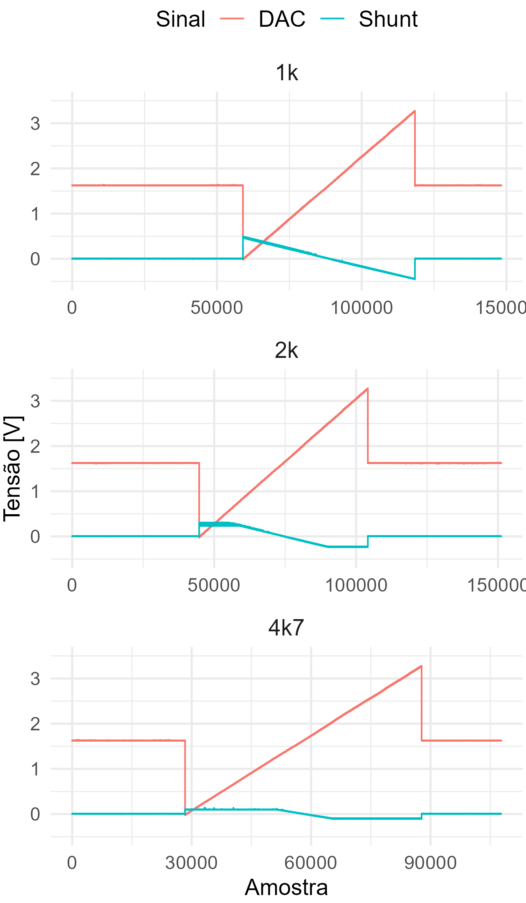

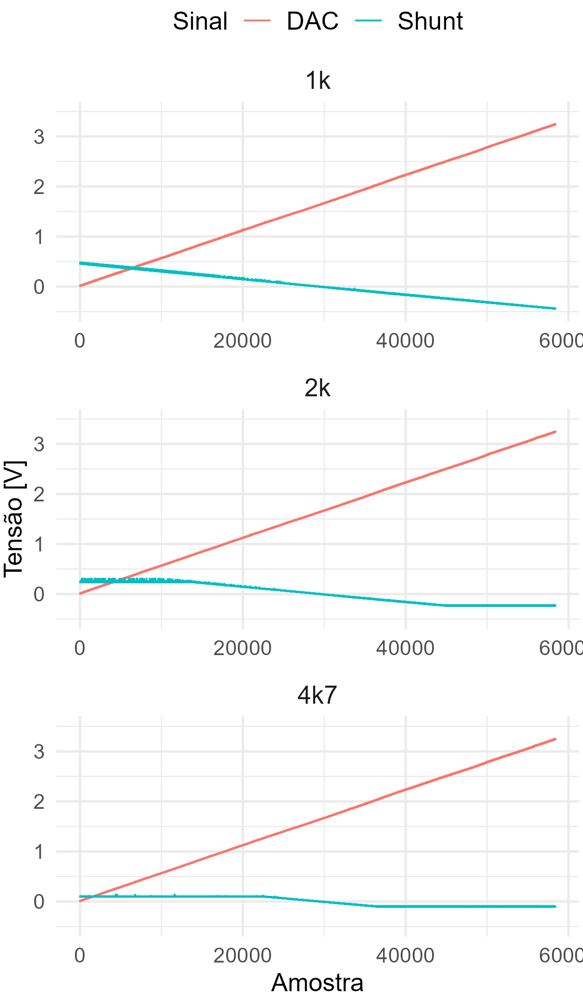

# 7. Conversão shunt-corrente

A corrente foi calculada por I = Vshunt / Rshunt, com Rshunt = 10 Ohm. A tolerância configurada do shunt é 1%.

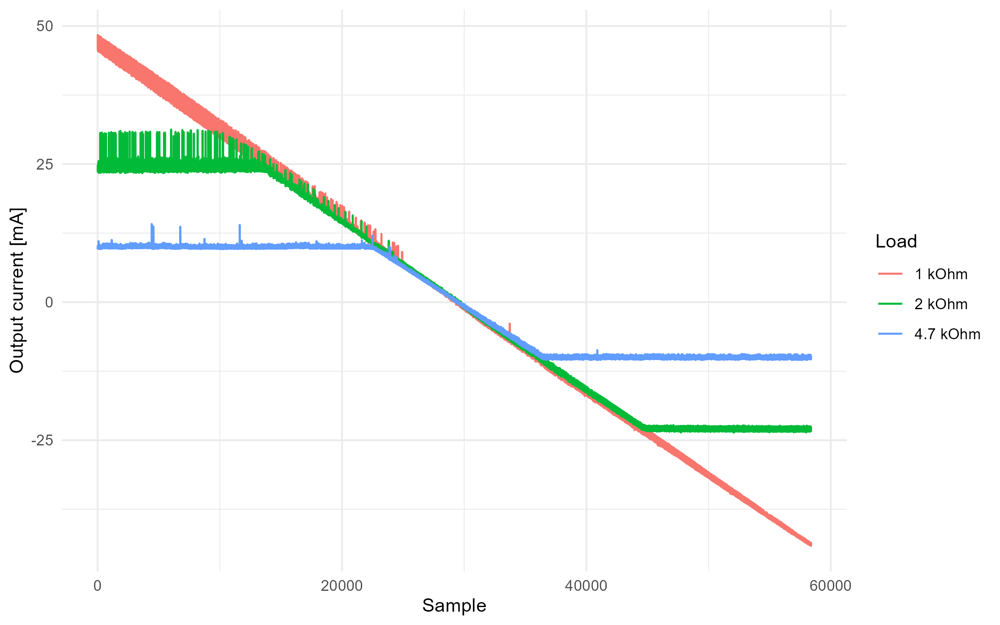

# 8. Identificação da região de compliance

A região comum de compliance foi definida antes da regressão usando dois critérios: limite físico pela tensão reconstruída na carga e inclinação local mínima compatível com o trecho linear de cada carga. O limite comum de tensão foi tomado como a menor magnitude máxima de tensão reconstruída entre as cargas, definindo uma faixa simétrica comum em torno de zero; em seguida, foram mantidos apenas os pontos do maior trecho contínuo com inclinação local suficiente. O modelo linear deve ser interpretado apenas dentro dessa região comum.

| load | Vmin | Vmax | common_Vmin | common_Vmax | reference_slope_mA_per_V | slope_threshold_mA_per_V | total_points | retained_points | removed_points | removed_percent |
| --- | --- | --- | --- | --- | --- | --- | --- | --- | --- | --- |
| 1k | -43.803125 | 46.330384 | -46.330384 | 46.330384 | 28.153212 | 14.076606 | 325 | 322 | 3 | 0.923077 |
| 2k | -46.224740 | 49.559811 | -46.330384 | 46.330384 | 27.808377 | 13.904188 | 325 | 168 | 157 | 48.307692 |
| 4k7 | -47.619405 | 47.775973 | -46.330384 | 46.330384 | 26.605116 | 13.302558 | 325 | 76 | 249 | 76.615385 |

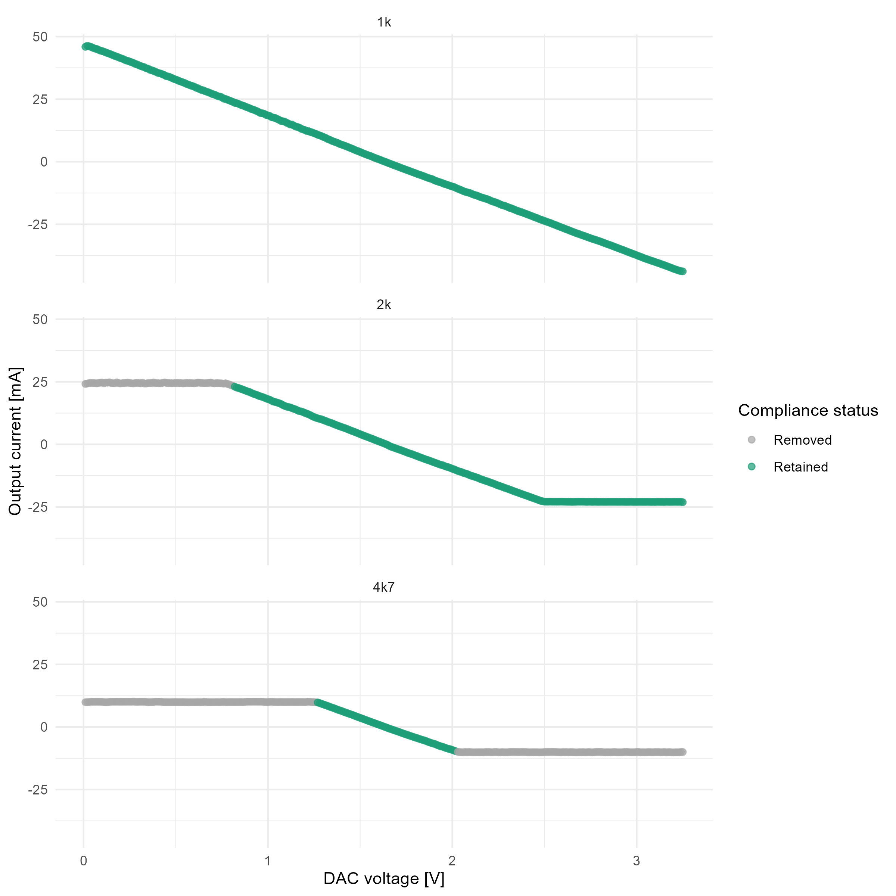

# 9. Estatística descritiva relevante

Resumo da região linear retida:

| load | count | mean_mA | sd_mA | min_mA | q25_mA | median_mA | q75_mA | max_mA |
| --- | --- | --- | --- | --- | --- | --- | --- | --- |
| 1k | 322 | 0.645672 | 26.179311 | -43.739572 | -21.889446 | -0.004240 | 23.329117 | 46.122148 |
| 2k | 168 | -0.142096 | 13.424850 | -22.740101 | -11.670383 | -0.463385 | 11.370625 | 23.062448 |
| 4k7 | 76 | -0.107802 | 5.777173 | -9.731551 | -5.021909 | -0.269278 | 4.849080 | 9.812040 |

# 10. Correlação exploratória

Correlação foi mantida apenas como evidência exploratória de associação monotônica/linear entre DAC e corrente. A validade do circuito é discutida a partir de erro, resíduos, intervalos e incerteza.

| load | pearson_r | pearson_p | spearman_r | spearman_p | samples | interpretation |
| --- | --- | --- | --- | --- | --- | --- |
| 1k | -0.999909 | 0 | -1 | 0 | 322 | Associacao linear exploratoria; validade do modelo avaliada por residuos, erro e incerteza. |
| 2k | -0.999897 | 0 | -1 | 0 | 168 | Associacao linear exploratoria; validade do modelo avaliada por residuos, erro e incerteza. |
| 4k7 | -0.999815 | 0 | -1 | 0 | 76 | Associacao linear exploratoria; validade do modelo avaliada por residuos, erro e incerteza. |

# 11. Modelos lineares por carga

Modelos independentes por carga foram ajustados como current_mA ~ dac_bin.

| model | load | R2 | adjusted_R2 | sigma_mA | samples | MAE_mA | RMSE_mA | max_abs_error_mA |
| --- | --- | --- | --- | --- | --- | --- | --- | --- |
| load_1k | 1k | 0.999818 | 0.999817 | 0.354077 | 322 | 0.287084 | 0.352975 | 0.743690 |
| load_2k | 2k | 0.999794 | 0.999792 | 0.193410 | 168 | 0.159041 | 0.192255 | 0.445245 |
| load_4k7 | 4k7 | 0.999630 | 0.999625 | 0.111824 | 76 | 0.095924 | 0.110343 | 0.252044 |

# 12. Modelo global

O modelo global foi ajustado como current_mA ~ dac_bin dentro da região comum de compliance.

| model | R2 | adjusted_R2 | sigma_mA | samples | MAE_mA | RMSE_mA | max_abs_error_mA |
| --- | --- | --- | --- | --- | --- | --- | --- |
| global_current_mA_by_dac | 0.999661 | 0.999661 | 0.389648 | 566 | 0.331486 | 0.388959 | 0.934792 |

# 13. Modelo com interação carga x DAC

O modelo com interação foi ajustado como current_mA ~ dac_bin * load.

| model | R2 | adjusted_R2 | sigma_mA | samples | MAE_mA | RMSE_mA | max_abs_error_mA |
| --- | --- | --- | --- | --- | --- | --- | --- |
| interaction_current_mA_by_dac_load | 0.999813 | 0.999811 | 0.290484 | 566 | 0.223411 | 0.288941 | 0.74369 |

| model | alpha | decision | term | estimate | std_error | statistic | p_value | ci_low | ci_high |
| --- | --- | --- | --- | --- | --- | --- | --- | --- | --- |
| global_current_mA_by_dac | 0.05 | reject_H0 | (Intercept) | 46.348935 | 0.039271 | 1180.239742 | 0 | 46.271801 | 46.426070 |
| global_current_mA_by_dac | 0.05 | reject_H0 | dac_bin | -28.033152 | 0.021733 | -1289.860154 | 0 | -28.075841 | -27.990464 |
| interaction_current_mA_by_dac_load | 0.05 | reject_H0 | (Intercept) | 46.618138 | 0.032754 | 1423.279796 | 0 | 46.553802 | 46.682473 |
| interaction_current_mA_by_dac_load | 0.05 | reject_H0 | dac_bin | -28.117716 | 0.017415 | -1614.538039 | 0 | -28.151923 | -28.083509 |
| interaction_current_mA_by_dac_load | 0.05 | reject_H0 | load2k | -1.087684 | 0.086165 | -12.623199 | 0 | -1.256931 | -0.918437 |
| interaction_current_mA_by_dac_load | 0.05 | reject_H0 | load4k7 | -3.699103 | 0.254191 | -14.552452 | 0 | -4.198387 | -3.199818 |
| interaction_current_mA_by_dac_load | 0.05 | reject_H0 | dac_bin:load2k | 0.521009 | 0.049385 | 10.549968 | 0 | 0.424007 | 0.618011 |
| interaction_current_mA_by_dac_load | 0.05 | reject_H0 | dac_bin:load4k7 | 1.961584 | 0.152886 | 12.830399 | 0 | 1.661285 | 2.261883 |
| load_1k | 0.05 | reject_H0 | (Intercept) | 46.618138 | 0.039924 | 1167.658226 | 0 | 46.539590 | 46.696685 |
| load_1k | 0.05 | reject_H0 | dac_bin | -28.117716 | 0.021228 | -1324.566419 | 0 | -28.159480 | -28.075952 |
| load_2k | 0.05 | reject_H0 | (Intercept) | 45.530454 | 0.053064 | 858.030359 | 0 | 45.425687 | 45.635221 |
| load_2k | 0.05 | reject_H0 | dac_bin | -27.596707 | 0.030769 | -896.900438 | 0 | -27.657456 | -27.535958 |
| load_4k7 | 0.05 | reject_H0 | (Intercept) | 42.919035 | 0.097037 | 442.296331 | 0 | 42.725685 | 43.112385 |
| load_4k7 | 0.05 | reject_H0 | dac_bin | -26.156132 | 0.058471 | -447.332761 | 0 | -26.272639 | -26.039625 |

# 14. Comparação entre modelos

A comparação formal entre o modelo global e o modelo com interação foi feita por ANOVA/teste F para modelos aninhados.

| compared_models | alpha | interpretation | model_index | Res.Df | RSS | Df | Sum of Sq | F | Pr(>F) |
| --- | --- | --- | --- | --- | --- | --- | --- | --- | --- |
| current_mA ~ dac_bin | 0.05 | NA | 1 | 564 | 85.629792 |  |  |  |  |
| current_mA ~ dac_bin * load | 0.05 | O modelo com interacao melhora significativamente o ajuste em relacao ao modelo global. | 2 | 560 | 47.253472 | 4 | 38.37632 | 113.699262 | 0 |

# 15. Erro de predição

As métricas de erro foram calculadas dentro da região linear: MAE, RMSE e maior erro absoluto.

| model | R2 | adjusted_R2 | sigma_mA | samples | MAE_mA | RMSE_mA | max_abs_error_mA |
| --- | --- | --- | --- | --- | --- | --- | --- |
| global_current_mA_by_dac | 0.999661 | 0.999661 | 0.389648 | 566 | 0.331486 | 0.388959 | 0.934792 |
| interaction_current_mA_by_dac_load | 0.999813 | 0.999811 | 0.290484 | 566 | 0.223411 | 0.288941 | 0.743690 |
| load_1k | 0.999818 | 0.999817 | 0.354077 | 322 | 0.287084 | 0.352975 | 0.743690 |
| load_2k | 0.999794 | 0.999792 | 0.193410 | 168 | 0.159041 | 0.192255 | 0.445245 |
| load_4k7 | 0.999630 | 0.999625 | 0.111824 | 76 | 0.095924 | 0.110343 | 0.252044 |

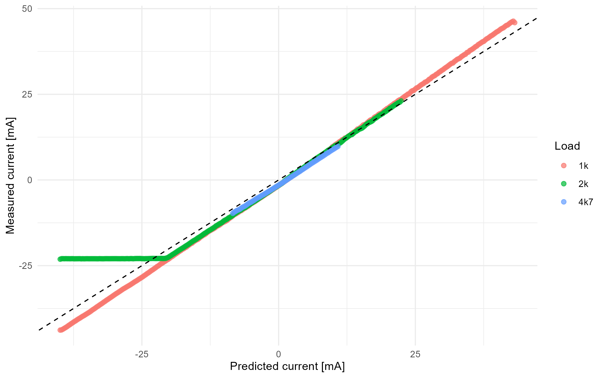

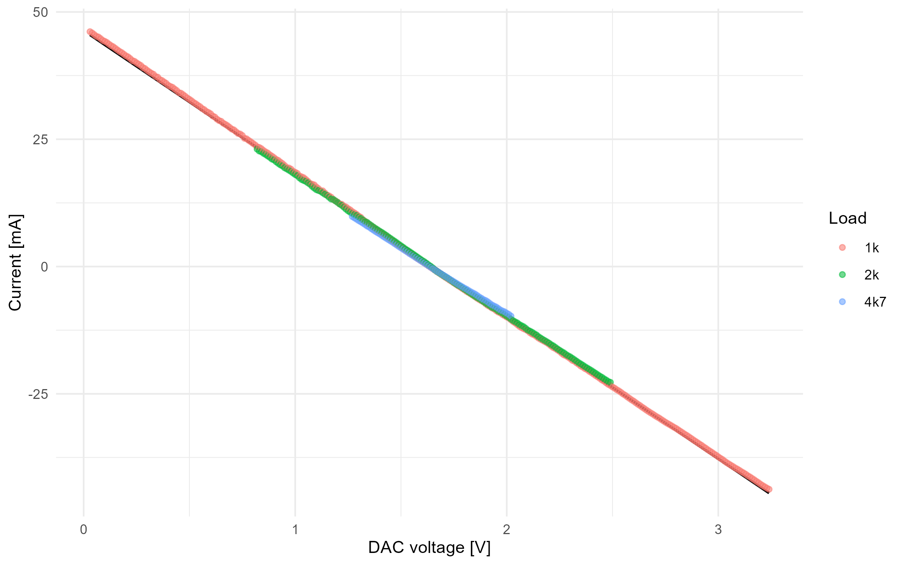

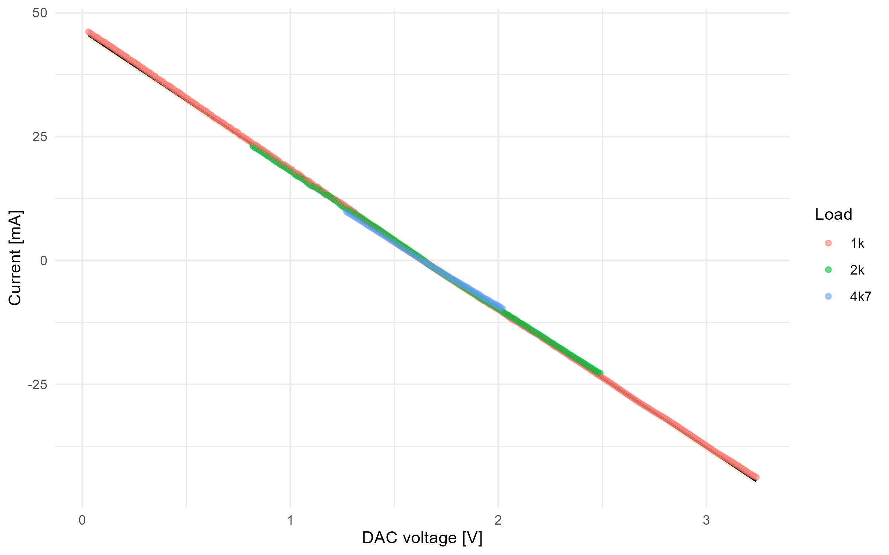

# 16. Diagnóstico dos resíduos

| model | mean_residual_mA | sd_residual_mA | median_residual_mA | min_residual_mA | max_residual_mA | MAE_mA | RMSE_mA | shapiro_sample_n | shapiro_p_value | normality_interpretation |
| --- | --- | --- | --- | --- | --- | --- | --- | --- | --- | --- |
| global_current_mA_by_dac | 0 | 0.389303 | 0.015381 | -0.934792 | 0.738906 | 0.331486 | 0.388959 | 566 | 0 | A normalidade dos residuos e questionavel pelo teste de Shapiro-Wilk. |

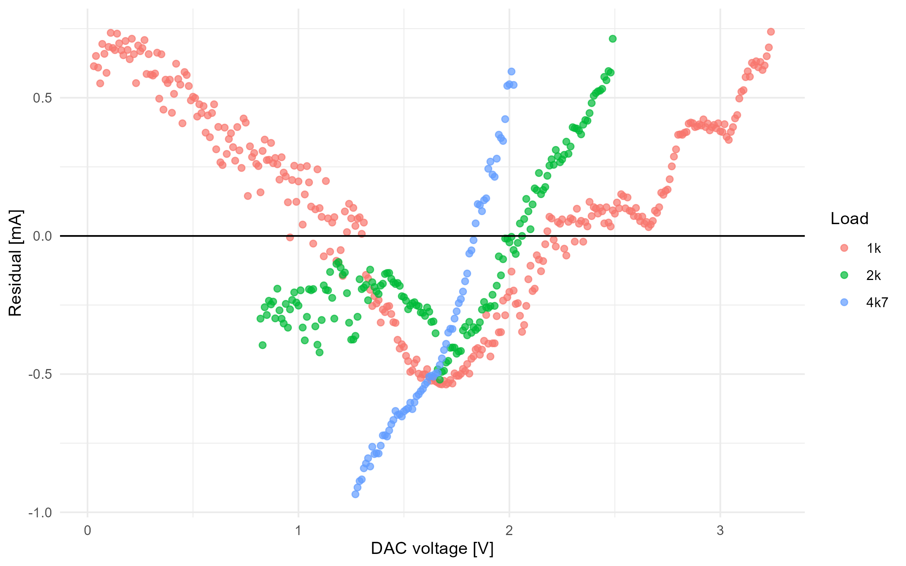

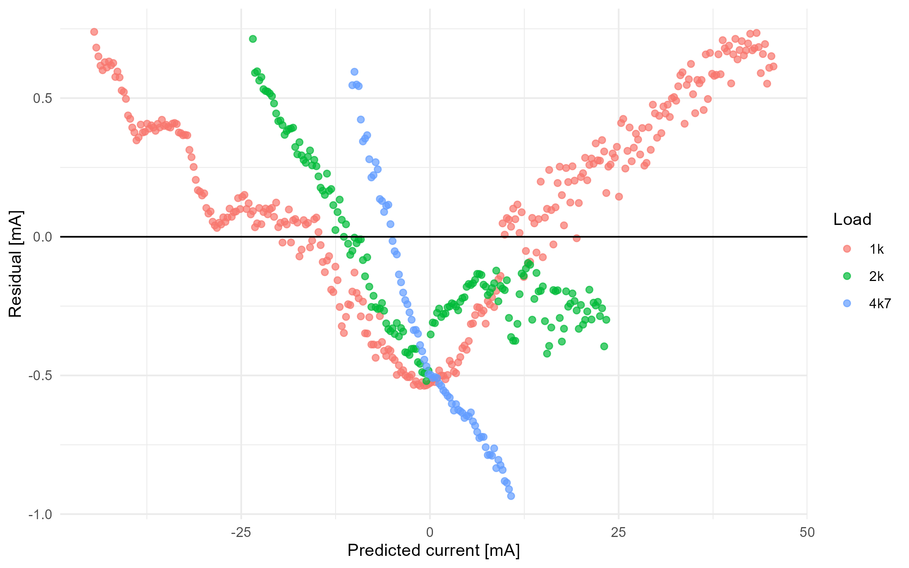

# 17. Homocedasticidade

| test | statistic | parameter | p_value | method | alpha | interpretation |
| --- | --- | --- | --- | --- | --- | --- |
| manual_breusch_pagan_residual_squared_on_fitted | 27.838682 | 1 | 0 | fallback | 0.05 | Ha evidencia de heterocedasticidade; a hipotese de variancia constante e questionavel. |

# 18. Autocorrelação temporal

Como os dados vêm de uma rampa temporal, a independência dos resíduos não foi assumida automaticamente.

| test | statistic | p_value | method | alpha | interpretation |
| --- | --- | --- | --- | --- | --- |
| manual_durbin_watson_approximation | 0.068879 | 0 | fallback_normal_approximation | 0.05 | Ha evidencia de autocorrelacao temporal; p-valores classicos da regressao podem estar otimistas. |

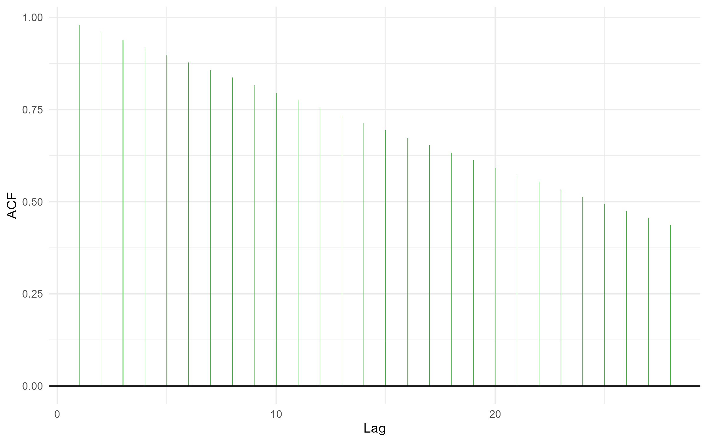

# 19. Outliers e influência

Foram calculados resíduos studentizados, leverage e distância de Cook. Pontos foram apenas marcados e reportados; a remoção automática permanece desativada por padrão.

| samples | influential_points | influential_percent | cook_threshold | max_cook_distance | max_abs_studentized_residual |
| --- | --- | --- | --- | --- | --- |
| 566 | 51 | 9.010601 | 0.007067 | 0.0178 | 2.411942 |

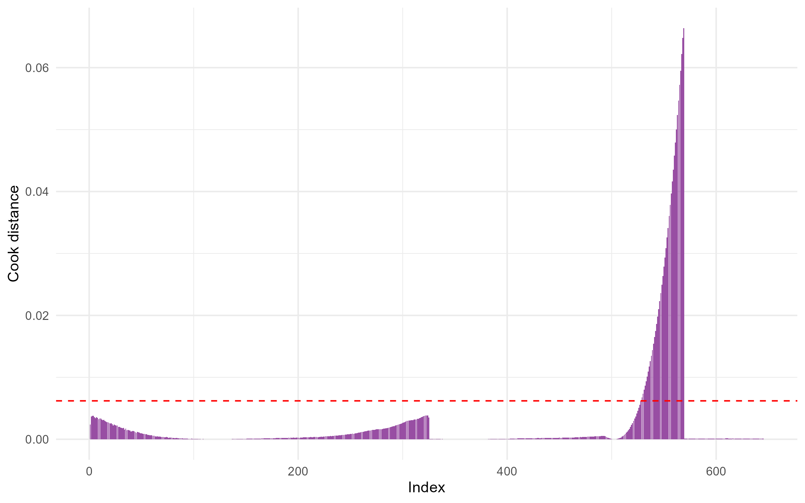

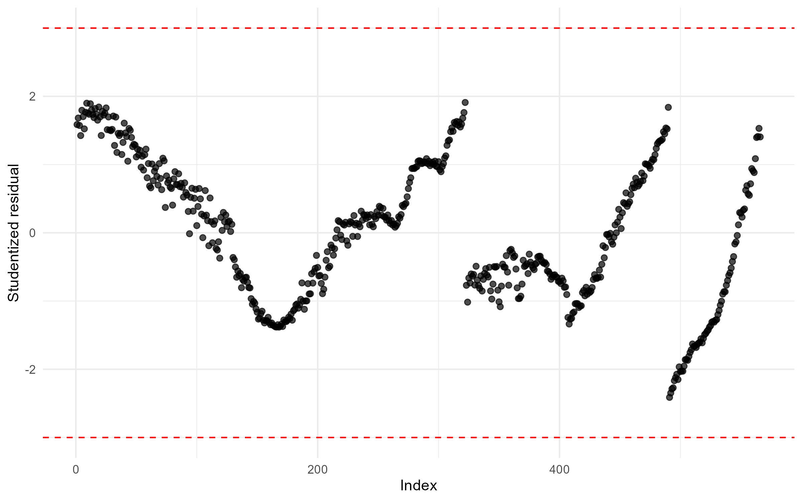

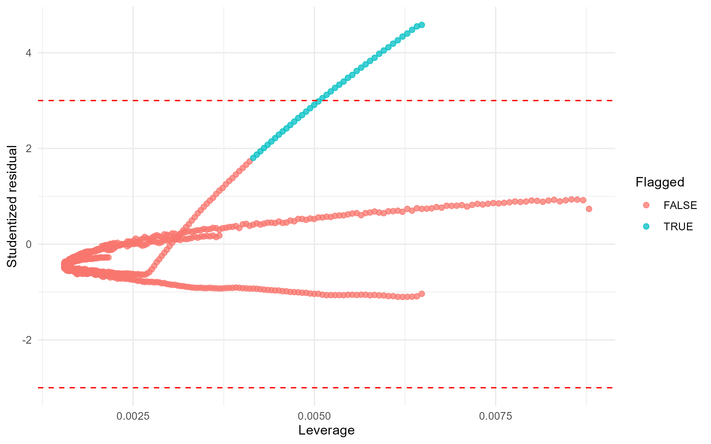

# 20. Validação cruzada por blocos

A validação por blocos usa cinco blocos contíguos ordenados, treinando em quatro blocos e testando no bloco remanescente. Isso evita usar apenas uma validação aleatória que mistura pontos vizinhos da rampa.

| fold | train_samples | test_samples | MAE_mA | RMSE_mA | max_abs_error_mA |
| --- | --- | --- | --- | --- | --- |
| 1 | 452 | 114 | 1.094951 | 1.149833 | 1.640076 |
| 2 | 453 | 113 | 0.336214 | 0.391106 | 0.604763 |
| 3 | 453 | 113 | 0.614323 | 0.672667 | 1.249332 |
| 4 | 453 | 113 | 0.287021 | 0.314989 | 0.575789 |
| 5 | 453 | 113 | 0.469936 | 0.525130 | 0.978239 |

| folds | RMSE_mean_mA | RMSE_sd_mA | MAE_mean_mA | MAE_sd_mA | max_abs_error_mean_mA | max_abs_error_sd_mA |
| --- | --- | --- | --- | --- | --- | --- |
| 5 | 0.610745 | 0.330716 | 0.560489 | 0.324743 | 1.00964 | 0.449455 |

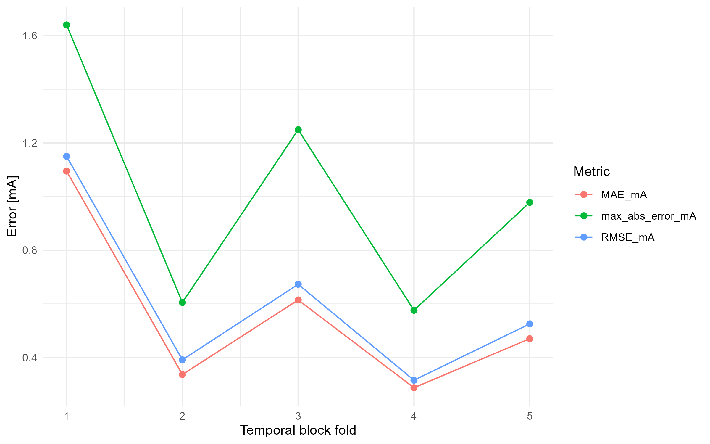

# 21. Conclusões revisadas

A caracterização sustenta um modelo linear de corrente em função do DAC apenas dentro da região comum de compliance definida pela tensão reconstruída na carga e pela manutenção de inclinação local compatível com o trecho linear. O modelo global é útil como aproximação operacional, mas sua adequação deve ser julgada junto com os erros de predição, intervalos de confiança/predição, diagnóstico residual e autocorrelação temporal. A ausência de realimentação de corrente no STIMGRASP limita a garantia de corrente entregue em operação real, especialmente fora das condições de carga ensaiadas ou quando o circuito se aproxima dos limites de compliance.

Análises como PCA, cluster e testes de média global foram preservadas somente como material secundário/didático e não são usadas como evidência central de validade metrológica do estágio de saída.

# 22. Referências

[1] T. P. Silva, "Experimental Characterization of the Output Stage of a Functional Electrical Stimulator Based on a Howland Current Source," artigo produzido no contexto da disciplina PEL309, Centro Universitário FEI, 2026.

