# Relatório de Caracterização Experimental do Estágio de Saída de um Estimulador Elétrico Funcional Baseado em Fonte de Corrente do tipo Howland

## 1. Problema

O item de estudo  é o estágio de saída de um estimulador elétrico funcional (FES) baseado em uma fonte de corrente Howland. Mais especificamente, o eletroestimulador denominado STIMGRASP, desenvolvido por Renato Barelli no ano de 2017 como parte de uma dissertação de mestrado. 

Nesta arquitetura, o microcontrolador define uma tensão de controle no DAC, e essa tensão deve produzir uma corrente de saída previsível no paciente ou em uma carga equivalente.

O problema central é que o circuito opera em malha aberta: o microcontrolador não mede a corrente real entregue durante a operação. Assim, se a carga mudar, se o contato eletrodo-pele piorar ou se o circuito atingir seu limite de tensão de operação (voltage-compliance), a corrente entregue pode deixar de seguir o valor esperado. Como não há realimentação de corrente, essa perda de previsibilidade não é detectada diretamente pelo firmware do STIMGRASP.

Por isso, é necessário caracterizar experimentalmente a relação entre tensão de DAC e corrente de saída, identificando:

- a região em que o circuito se comporta aproximadamente como fonte de corrente;
- a influência da carga resistiva sobre a corrente entregue;
- um modelo matemático que permita estimar a tensão de DAC necessária para uma corrente desejada;
- evidências estatísticas de linearidade, consistência e limitação por compliance.

## 2. Motivação

Em estimulação elétrica funcional, a amplitude de corrente está associada à resposta neuromuscular, ao conforto do usuário e à repetibilidade do protocolo de estimulação. Se a corrente real não for previsível, o mesmo comando digital pode gerar respostas diferentes em diferentes condições de carga.

Um estudo similar foi realizado primariamente pelo autor deste relatório no artigo **Experimental Characterization of the Output Stage of a Functional Electrical Stimulator Based on a Howland Current Source**. Esse artigo foi desenvolvido como entregável da disciplina de Data Science, PEL309, utilizando Python. Nele, o estágio de saída do STIMGRASP foi caracterizado experimentalmente por meio da relação entre tensão de DAC e corrente de saída, seleção da região de compliance, correlação, regressão linear e identificação de um modelo global para operação em malha aberta.

O presente relatório aprofunda essa caracterização com uma análise estatística mais ampla em R, incorporando os tópicos estudados na disciplina PME406: curva normal, normal reduzida Z, distribuição amostral, intervalos de confiança, nível de significância, testes de hipótese, correlação, regressão linear simples e múltipla, ANOVA, DOE, regressão logística, PCA, análise fatorial e cluster.

## 3. Objetivo

O objetivo do script é executar uma análise estatística completa da relação entre tensão de DAC e corrente de saída para três cargas resistivas: 1 kOhm, 2 kOhm e 4,7 kOhm.

Os objetivos específicos são:

- importar os dados experimentais do osciloscópio;
- extrair a região útil da rampa de DAC;
- converter tensão no resistor shunt em corrente de saída;
- agregar os dados por bins de tensão de DAC;
- identificar a região comum de compliance;
- avaliar linearidade por correlação e regressão;
- ajustar um modelo global para uso em firmware;
- avaliar os resíduos e sua aderência à curva normal;
- explicitar grau de confiança, nível de significância, p-valores e decisões de hipótese;
- comparar o comportamento entre cargas;
- aplicar métodos multivariados ensinados na disciplina.

## 4. Estrutura do código

O arquivo principal é `analise_rstudio.R`.

### 4.1 Carregamento de pacotes

O script começa verificando se o pacote `tidyverse` está instalado. Caso não esteja, ele instala automaticamente:

```r
if (!requireNamespace("tidyverse", quietly = TRUE)) {
  install.packages("tidyverse")
}

library(tidyverse)
```

O `tidyverse` é usado para leitura dos arquivos CSV, transformação de dados, sumarização estatística e gráficos.

### 4.2 Importação dos dados

Os dados são lidos diretamente de arquivos CSV exportados do osciloscópio:

```r
read_scope_csv <- function(url) {
  read_csv(
    url,
    skip = 17,
    col_select = 2:3,
    show_col_types = FALSE
  ) |>
    set_names(c("dac_volts", "shunt_volts")) |>
    mutate(sample = row_number() - 1)
}
```

Cada arquivo contém duas grandezas principais:

- `dac_volts`: tensão de controle aplicada ao estágio de saída;
- `shunt_volts`: tensão medida no resistor shunt, usada para calcular corrente.

Os dados brutos podem ser acessados diretamente nos links:

| Carga | Link para o CSV bruto |
|---|---|
| 1 kOhm | <https://raw.githubusercontent.com/import-tiago/FEI/refs/heads/main/MSc/PEL309/0.Data/1k.csv> |
| 2 kOhm | <https://raw.githubusercontent.com/import-tiago/FEI/refs/heads/main/MSc/PEL309/0.Data/2k.csv> |
| 4,7 kOhm | <https://raw.githubusercontent.com/import-tiago/FEI/refs/heads/main/MSc/PEL309/0.Data/4k7.csv> |

Antes de qualquer tratamento, a carga de 1 kOhm possui dados crus no seguinte formato:

| Amostra | DAC voltage (V) | Shunt voltage (V) |
|---:|---:|---:|
| 0 | 1,62515625 | 0,002984375 |
| 1 | 1,62578125 | 0,002796875 |
| 2 | 1,62515625 | 0,001015625 |
| 3 | 1,62578125 | 0,003046875 |
| 4 | 1,62515625 | 0,005046875 |
| 5 | 1,62546875 | 0,002875000 |
| 6 | 1,62546875 | 0,003156250 |
| 7 | 1,62515625 | 0,002609375 |
| 8 | 1,62546875 | 0,002125000 |
| 9 | 1,62546875 | 0,003265625 |
| 10 | 1,62546875 | 0,003500000 |
| 11 | 1,62546875 | 0,002468750 |

Essa tabela corresponde diretamente ao objeto:

```r
summary_tables$raw_1k_preview
```

Ela é apresentada antes da extração da rampa, antes da conversão da tensão do shunt em corrente e antes da agregação por bins de DAC.


**Figura 1.** Sinais brutos das três cargas antes da remoção dos trechos estacionários. Observam-se os períodos inicial e final próximos ao ponto de repouso, além do trecho central correspondente à rampa útil de DAC.

### 4.3 Extração da rampa útil

O osciloscópio registra também trechos estacionários antes e depois da rampa. A função `extract_ramp_region()` detecta transições bruscas na tensão de DAC e remove as regiões de repouso:

```r
delta <- abs(data[[column]] - dplyr::lag(data[[column]]))
transition_points <- which(delta > trigger_threshold)
```

Com isso, a análise passa a considerar apenas o trecho experimental em que o DAC varre a faixa de tensão de interesse.


**Figura 2.** Sinais das três cargas após a remoção dos trechos estacionários e equalização do número de amostras. Esta é a região experimental efetivamente usada nas etapas seguintes de cálculo de corrente, binning e modelagem.

### 4.4 Conversão para corrente

A corrente é calculada pela lei de Ohm usando o resistor shunt de 10 Ohm:

```r
current_mA = shunt_volts / shunt_resistance_ohm * 1000
```

Assim, a tensão medida no shunt é convertida para corrente em miliampères.


**Figura 3.** Corrente calculada para as três cargas após a extração da rampa útil e conversão da tensão no resistor shunt. Este gráfico ainda está no domínio das amostras, antes da agregação por bins de tensão de DAC.

### 4.5 Binning da tensão de DAC

Para reduzir ruído e granulosidade, os dados são agrupados em intervalos de 10 mV:

```r
dac_step <- 0.01

processed_current_data <- all_currents |>
  mutate(dac_bin = round(round(dac_volts / dac_step) * dac_step, 2)) |>
  group_by(dac_bin, load) |>
  summarise(current_mA = mean(current_mA, na.rm = TRUE), .groups = "drop")
```

Esse conjunto agregado contém tanto a região linear quanto regiões limitadas por compliance.

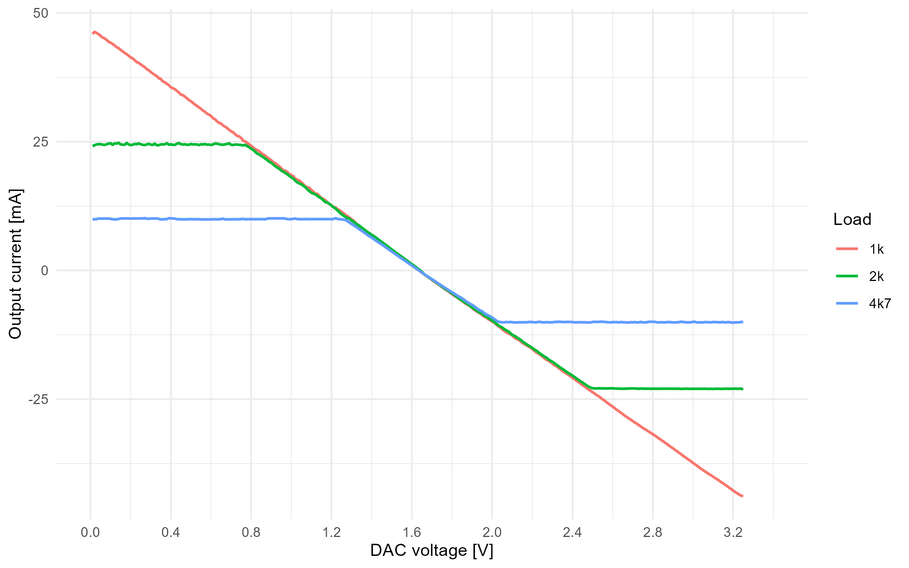

**Figura 4.** Corrente de saída em função da tensão de DAC para as três cargas, antes da remoção da região limitada por compliance. A saturação mais evidente nas cargas maiores mostra que nem toda a faixa de DAC pode ser usada para modelagem linear.

## 5. Identificação da região de compliance

A tensão na carga é reconstruída por:

```r
vload <- processed_current_data[[load]] / 1000 * resistance
```

Para cada carga, o script estima os limites mínimo e máximo de tensão na carga. A região comum válida é definida pelo intervalo em que todas as cargas ainda permanecem dentro de uma região experimentalmente suportada.

Resultado principal:

| Carga | Vmin estimado | Vmax estimado |
|---|---:|---:|
| 1 kOhm | -43,8 V | 46,3 V |
| 2 kOhm | -46,2 V | 49,6 V |
| 4,7 kOhm | -47,6 V | 47,8 V |

A região comum selecionada ficou aproximadamente entre -43,8 V e 46,3 V.

Após essa seleção, a quantidade de pontos válidos foi:

| Carga | Pontos processados | Pontos lineares | Pontos removidos | Removido (%) |
|---|---:|---:|---:|---:|
| 1 kOhm | 325 | 323 | 2 | 0,615% |
| 2 kOhm | 325 | 164 | 161 | 49,5% |
| 4,7 kOhm | 325 | 74 | 251 | 77,2% |

Interpretação: cargas maiores exigem maior tensão para a mesma corrente. Por isso, a carga de 4,7 kOhm entra em limitação de compliance mais cedo, restando menos pontos válidos para modelagem linear. Nesta etapa, o objetivo é apenas definir quais pontos permanecem fisicamente válidos para a análise. A regressão linear propriamente dita é apresentada mais adiante, depois da correlação e da definição formal do modelo.

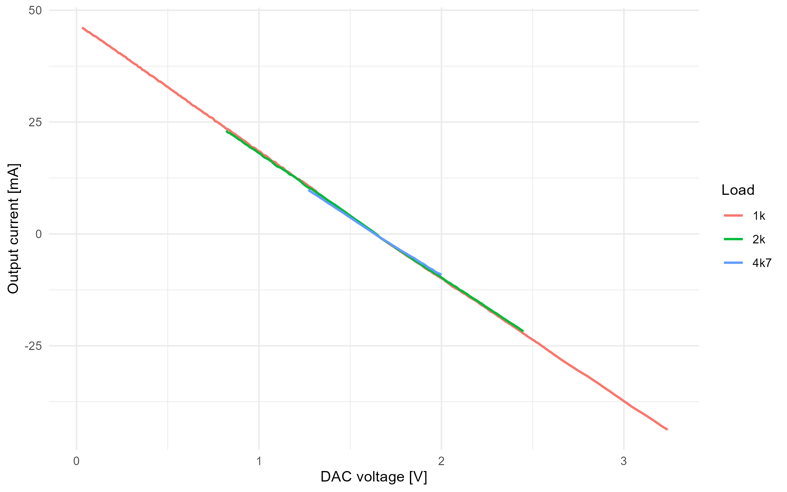

**Figura 5.** Corrente de saída em função da tensão de DAC após a remoção dos pontos fora da região comum de compliance. Esta figura mostra apenas a região fisicamente válida para as análises estatísticas posteriores, ainda sem sobreposição de modelo de regressão.

## 6. Distribuição normal, distribuição amostral e normal reduzida Z

A distribuição normal é uma referência central para a análise inferencial, especialmente na construção de intervalos de confiança e na interpretação de estatísticas padronizadas. Ela é simétrica em torno da média, possui área total igual a 1 e pode ser padronizada pela variável normal reduzida:

```text
Z = (X - media) / desvio_padrao
```

Para a análise da média amostral, utiliza-se a ideia de distribuição amostral: a média calculada em uma amostra é uma estatística sujeita à variabilidade amostral. O erro padrão da média é dado por:

```text
erro padrao = s / sqrt(n)
```

em que `s` é o desvio padrão amostral e `n` é o número de amostras. Essa relação é usada para quantificar a incerteza associada às médias de corrente medidas em cada carga.

Também foi criada a tabela `z_reference_table`, relacionando grau de confiança, nível de significância e valor crítico Z:

| Confiança | Significância alpha | Z crítico bilateral |
|---:|---:|---:|
| 90% | 0,10 | 1,64 |
| 95% | 0,05 | 1,96 |
| 99% | 0,01 | 2,58 |

Esses valores são usados como referência para interpretar intervalos bilaterais associados a diferentes graus de confiança.

## 7. Estatística descritiva, confiança e distribuição t

O script calcula estatísticas descritivas para a região completa e para a região linear. Na região linear, as médias de corrente ficaram próximas de zero, como esperado para uma rampa simétrica em torno do ponto de corrente nula.

Foi adotado:

```text
alpha = 0,05
grau de confiança = 1 - alpha = 0,95
```

Como o desvio padrão populacional não é conhecido, a análise usa a distribuição t de Student para os intervalos de confiança.

Intervalos de confiança de 95% para a média da corrente:

| Carga | Média (mA) | IC 95% inferior | IC 95% superior | Amostras |
|---|---:|---:|---:|---:|
| 1 kOhm | 0,786 | -2,09 | 3,66 | 323 |
| 2 kOhm | 0,401 | -1,62 | 2,42 | 164 |
| 4,7 kOhm | 0,148 | -1,16 | 1,45 | 74 |

Interpretação: os intervalos incluem zero, o que é coerente com a varredura de corrente positiva e negativa em torno do ponto central do DAC. Como zero pertence aos intervalos, não há evidência suficiente, ao nível de 5% de significância, para afirmar que a média da corrente em cada carga seja diferente de zero.

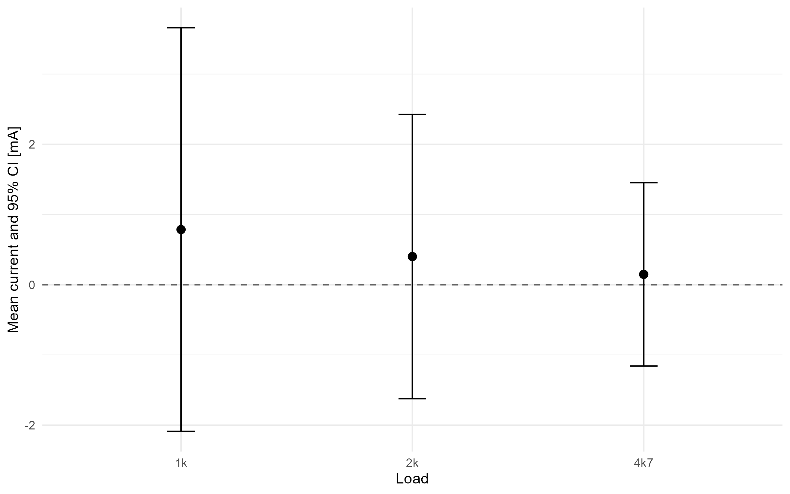

**Figura 6.** Médias de corrente e intervalos de confiança de 95% para cada carga. Como a linha de 0 mA atravessa os intervalos, os testes de uma média não rejeitam H0.

## 8. Testes de hipótese, significância e p-valor

A análise explicita as hipóteses nula e alternativa, o nível de significância, o p-valor e a decisão estatística. Nesta etapa, os testes são aplicados somente às médias de corrente, pois ainda não foram definidos os modelos de regressão e seus resíduos.

A regra de decisão usada foi:

```text
se p-valor < alpha, rejeita H0
se p-valor >= alpha, nao rejeita H0
```

Com `alpha = 0,05`, os principais resultados foram:

| Análise | H0 | p-valor | Decisão |
|---|---|---:|---|
| Média da corrente 1k | média = 0 | 0,591 | não rejeita H0 |
| Média da corrente 2k | média = 0 | 0,696 | não rejeita H0 |
| Média da corrente 4k7 | média = 0 | 0,822 | não rejeita H0 |

Interpretação: para as três cargas, não há evidência estatística suficiente para rejeitar a hipótese de que a média da corrente seja igual a zero. Esse resultado é coerente com a rampa ser aproximadamente simétrica em torno do ponto de corrente nula.

## 9. Testes de duas médias

Também foram aplicados testes t pareados entre cargas, permitindo avaliar se as diferenças médias entre pares de cargas são estatisticamente significativas.

Resultados principais:

| Comparação | Diferença média (mA) | p-valor | Decisão com alpha = 0,05 |
|---|---:|---:|---|
| 1k vs 2k | -0,109 | 3,88e-10 | rejeita H0 |
| 1k vs 4k7 | -0,00263 | 0,962 | não rejeita H0 |
| 2k vs 4k7 | 0,107 | 0,0299 | rejeita H0 |

Interpretação: há diferenças estatisticamente significativas entre 1k e 2k e entre 2k e 4k7, mas as diferenças médias são pequenas em magnitude prática. Este é um ponto didático importante: significância estatística não é necessariamente relevância prática.

## 10. Correlação

Foram calculadas correlações de Pearson e Spearman entre `dac_bin` e `current_mA` para cada carga, usando apenas a região linear.

Resultados:

| Carga | Pearson r | Spearman rho |
|---|---:|---:|
| 1 kOhm | aproximadamente -1,000 | aproximadamente -1,000 |
| 2 kOhm | aproximadamente -1,000 | aproximadamente -1,000 |
| 4,7 kOhm | aproximadamente -1,000 | aproximadamente -1,000 |

Interpretação: existe associação linear e monotônica praticamente perfeita entre tensão de DAC e corrente dentro da região válida. O sinal negativo indica que, neste circuito, aumentar a tensão de DAC reduz a corrente medida.

## 11. Regressão linear simples

O modelo direto usado é:

```text
Iout = a * VDAC + b
```

O script ajusta regressões por carga:

| Carga | Inclinação a (mA/V) | Intercepto b (mA) | R² |
|---|---:|---:|---:|
| 1 kOhm | -28,1 | 46,6 | aproximadamente 1,000 |
| 2 kOhm | -27,6 | 45,6 | aproximadamente 1,000 |
| 4,7 kOhm | -26,2 | 43,0 | aproximadamente 1,000 |

Interpretação: as inclinações são muito próximas, mas não idênticas. Isso mostra que o comportamento é altamente linear em cada carga, embora ainda exista alguma dependência residual da carga.

## 12. Modelo global para firmware

Também foi ajustado um modelo global com todas as cargas na região linear:

| Métrica | Valor |
|---|---:|
| Inclinação | -28,04 mA/V |
| Intercepto | 46,35 mA |
| MAE | 0,329 mA |
| RMSE | 0,386 mA |
| Erro máximo absoluto | 0,931 mA |
| R² | aproximadamente 1,000 |

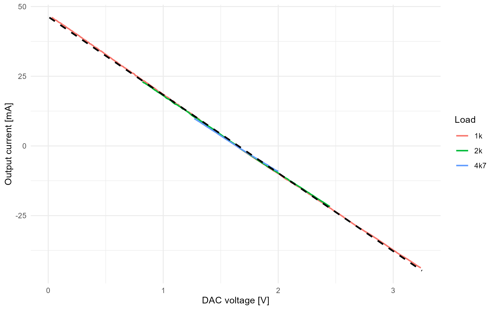

**Figura 7.** Região linear após remoção dos pontos limitados por compliance, com sobreposição do modelo linear global. Esta figura aparece nesta seção porque a linha tracejada só faz sentido depois de definida a regressão linear e seus coeficientes.

O modelo global é:

```text
Iout = -28,04 * VDAC + 46,35
```

Para uso no firmware, a equação inversa é:

```text
VDAC = (Itarget - b) / a
```

Logo:

```text
VDAC = (Itarget - 46,35) / -28,04
```

Interpretação: o modelo global é adequado para estimar o DAC a partir da corrente desejada, desde que a operação permaneça dentro da região comum de compliance. Fora dessa região, o modelo pode pedir uma corrente que o circuito não consegue entregar fisicamente.

## 13. Resíduos e validação

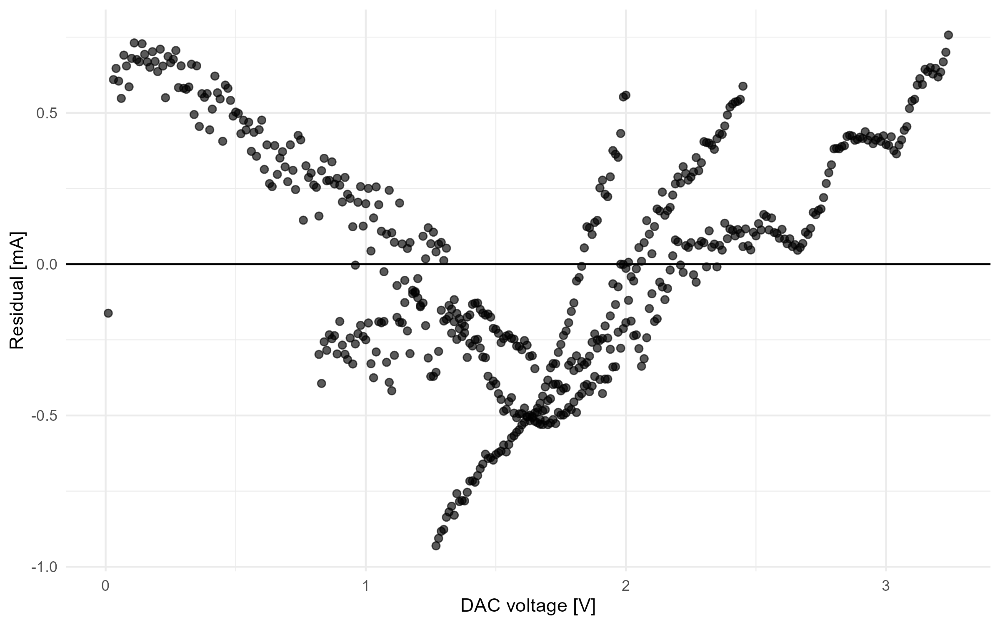

**Figura 8.** Resíduos do modelo global em função da tensão de DAC. A concentração dos resíduos ao redor de zero indica bom ajuste, enquanto pequenos padrões sistemáticos ajudam a explicar a rejeição de normalidade perfeita.

O teste t da média dos resíduos resultou em p-valor aproximadamente 1, indicando que a média residual não é estatisticamente diferente de zero.

Resumo dos resíduos:

| Métrica | Valor |
|---|---:|
| Média | aproximadamente 0 mA |
| Desvio padrão | 0,386 mA |
| Mínimo | -0,931 mA |
| Máximo | 0,757 mA |
| MAE | 0,329 mA |
| RMSE | 0,386 mA |

A validação cruzada com 5 folds apresentou RMSE médio de aproximadamente 0,386 mA, praticamente igual ao erro do ajuste global.

Interpretação: o modelo não parece estar apenas memorizando os dados. O erro de validação é consistente com o erro de ajuste.

Além da análise de magnitude dos resíduos, foi avaliada sua compatibilidade com uma distribuição normal. Primeiro, calcula-se a média e o desvio padrão dos resíduos:

```r
residual_mean <- mean(global_model_data$residual_mA)
residual_sd <- sd(global_model_data$residual_mA)
```

Em seguida, é criada uma curva normal teórica com a mesma média e o mesmo desvio padrão:

```r
normal_curve_data <- tibble(
  residual_mA = seq(
    residual_mean - 4 * residual_sd,
    residual_mean + 4 * residual_sd,
    length.out = 400
  ),
  normal_density = dnorm(residual_mA, mean = residual_mean, sd = residual_sd),
  standard_z = (residual_mA - residual_mean) / residual_sd
)
```

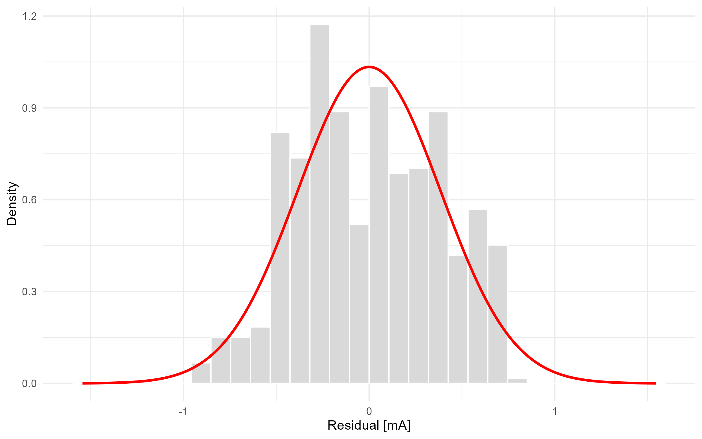

**Figura 9.** Histograma dos resíduos do modelo global com a curva normal teórica ajustada pela média e pelo desvio padrão dos resíduos. A figura permite avaliar visualmente se a distribuição residual se aproxima de uma normal.

O resumo `residual_standard_normal_summary` compara a proporção real dos resíduos dentro de 1, 2 e 3 desvios padrão com a proporção esperada pela normal. O resultado mostrou cerca de 61,1% dos resíduos dentro de 1 desvio padrão, contra 68,3% esperado na normal, com proporções mais próximas do esperado para faixas mais amplas.

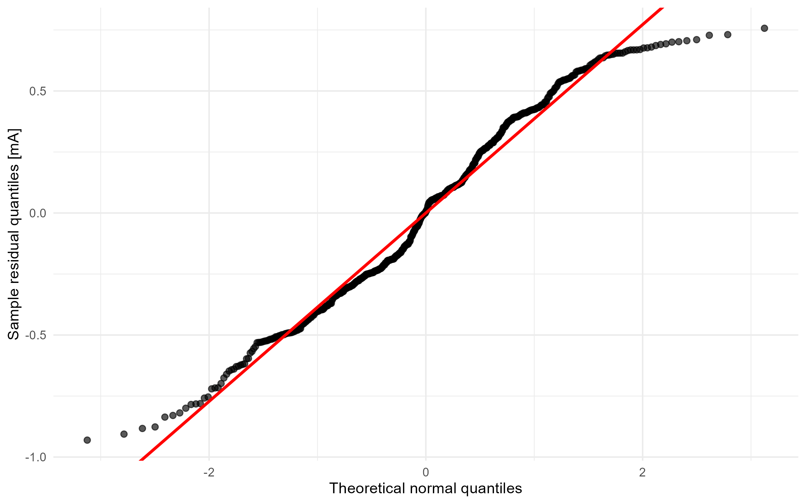

**Figura 10.** QQ-plot dos resíduos. Se os resíduos fossem perfeitamente normais, os pontos ficariam próximos da linha vermelha. Os desvios observados explicam a rejeição da normalidade pelo teste de Shapiro-Wilk.

O teste de Shapiro-Wilk apresentou p-valor de aproximadamente `1,15e-7`, rejeitando a hipótese de normalidade perfeita dos resíduos ao nível de significância de 5%. Esse resultado não invalida o modelo linear, mas indica pequenas assimetrias, caudas ou estrutura residual detectável.

## 14. ANOVA e DOE

Foram feitas duas análises:

- ANOVA simples: `current_mA ~ load`;
- ANOVA fatorial: `current_mA ~ load * dac_level`, onde `dac_level` divide a faixa de DAC em quatro níveis.

Na ANOVA simples, o efeito de carga isolado teve p-valor de aproximadamente 0,965. Isso indica que, quando se ignora a posição do DAC, a média global da corrente não muda significativamente entre cargas.

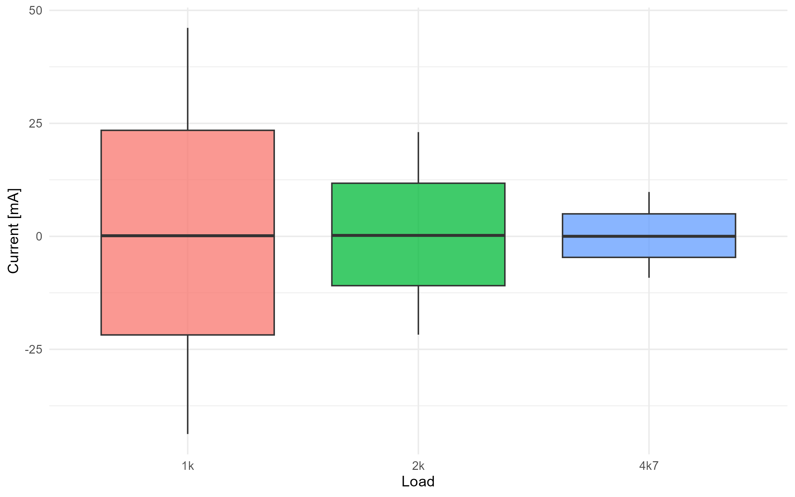

**Figura 11.** Distribuição da corrente na região linear por carga. O gráfico ajuda a visualizar por que a ANOVA simples não encontra diferença significativa entre médias globais de corrente por carga.

Na ANOVA fatorial, os efeitos de `dac_level` e da interação `load:dac_level` foram significativos.

Interpretação: a tensão de DAC é o fator dominante. A interação significativa indica que a forma como a corrente varia com o DAC muda levemente conforme a carga, o que é coerente com os resultados das regressões por carga.

## 15. Regressão linear múltipla

O modelo múltiplo ajustado foi:

```r
current_mA ~ dac_bin * load
```

Esse modelo permite inclinações e interceptos diferentes por carga.

Resultados principais:

| Métrica | Valor |
|---|---:|
| R² | aproximadamente 1,000 |
| R² ajustado | aproximadamente 1,000 |
| Sigma | 0,290 mA |

Comparado ao modelo global simples, o modelo com interação reduz a soma de quadrados residual, com p-valor muito pequeno na comparação entre modelos.

Interpretação: estatisticamente, permitir parâmetros diferentes por carga melhora o ajuste. Porém, para firmware embarcado, o modelo global continua mais simples e ainda apresenta erro pequeno. A escolha entre modelo global e modelos por carga depende de o sistema conhecer ou estimar a carga durante a operação.

## 16. Regressão logística para compliance

A regressão logística modelou a probabilidade de uma amostra estar dentro da região comum de compliance usando:

```r
in_common_compliance_region ~ dac_distance_from_zero_current + load_resistance_ohm
```

Resultados:

| Termo | Interpretação |
|---|---|
| `dac_distance_from_zero_current` negativo | quanto mais longe do ponto central do DAC, menor a chance de permanecer na região comum de compliance |
| `load_resistance_ohm` negativo | quanto maior a carga, menor a chance de permanecer dentro da região comum |

A acurácia de classificação foi aproximadamente 0,881.

Interpretação: o resultado confirma quantitativamente que a limitação de compliance depende tanto da amplitude comandada quanto da carga.

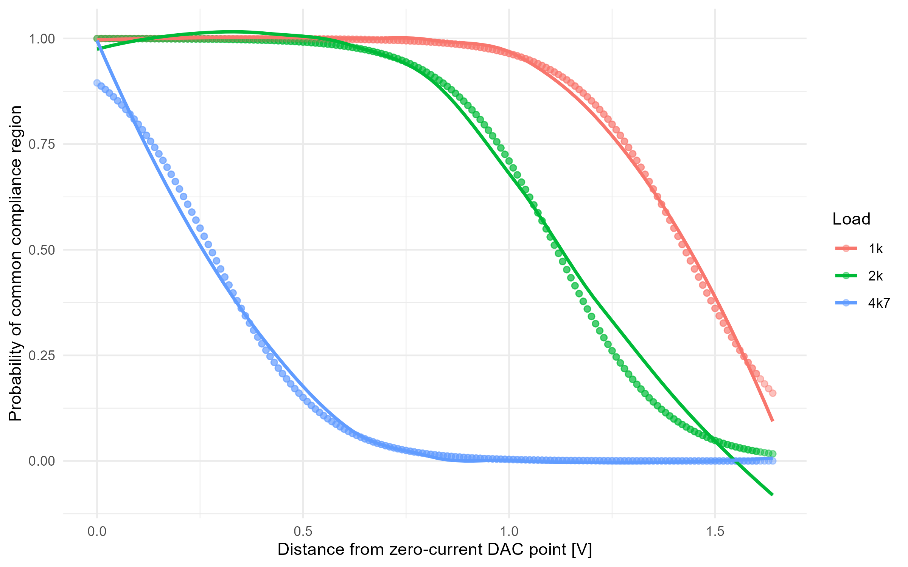

**Figura 12.** Probabilidade estimada de permanência na região comum de compliance em função da distância ao ponto central do DAC. A probabilidade cai quando o comando se afasta do centro e quando a carga exige maior tensão.

## 17. PCA e análise fatorial

A PCA foi aplicada às correntes das três cargas na região comum.

Resultado principal:

| Componente | Proporção de variância |
|---|---:|
| PC1 | aproximadamente 1,000 |
| PC2 | aproximadamente 0,000060 |
| PC3 | aproximadamente 0,000011 |

Interpretação: quase toda a variabilidade das três correntes é explicada por uma única componente principal. Isso indica que as três cargas compartilham praticamente o mesmo padrão de variação, dominado pela rampa de DAC.

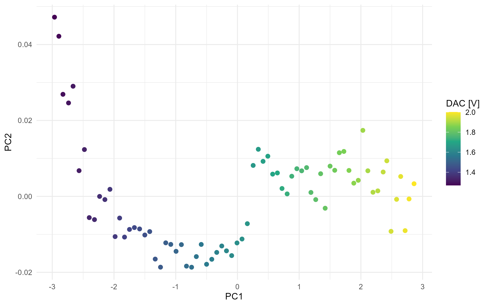

**Figura 13.** Escores da PCA. A coloração pela tensão de DAC mostra que a primeira componente organiza os dados conforme a posição ao longo da rampa.

A análise fatorial com um fator produziu cargas fatoriais próximas de 0,999 para as três cargas.

Interpretação: há um fator comum muito forte, compatível com a ideia de que o DAC é o principal fator latente controlando as correntes medidas.

## 18. Cluster analysis

O k-means com três clusters separou os pontos da região linear em três grupos:

| Cluster | Interpretação aproximada |
|---|---|
| 1 | região próxima ao ponto central, corrente média próxima de zero |
| 2 | região de corrente negativa |
| 3 | região de corrente positiva |

Interpretação: o agrupamento recupera naturalmente a estrutura da rampa: um grupo para correntes positivas, um para correntes negativas e outro para a região central. Isso reforça que a principal estrutura multivariada dos dados é a posição ao longo da rampa de DAC.

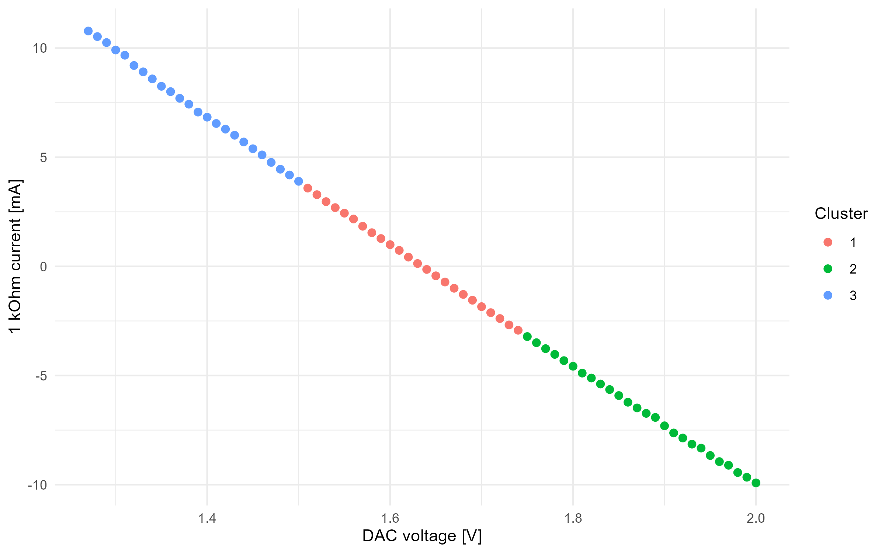

**Figura 14.** Agrupamento k-means com três clusters. Os grupos separam regiões de corrente positiva, corrente negativa e região próxima ao ponto central de corrente nula.

## 19. Conclusões

A análise confirma que o estágio de saída apresenta comportamento altamente linear entre tensão de DAC e corrente de saída dentro da região de compliance. As correlações próximas de -1, os valores de R² próximos de 1 e os baixos erros de regressão sustentam o uso de um modelo linear para estimativa em malha aberta.

O modelo global:

```text
Iout = -28,04 * VDAC + 46,35
```

é simples e adequado para implementação em firmware, desde que limitado à região comum de compliance. A equação inversa permite estimar a tensão de DAC necessária para uma corrente alvo.

Entretanto, a análise também mostra que cargas maiores reduzem a região operacional válida. A carga de 4,7 kOhm perdeu cerca de 77,2% dos pontos após a seleção da região linear, indicando forte limitação de compliance em parte da faixa de DAC. Portanto, o modelo linear não deve ser usado indiscriminadamente fora da região caracterizada.

Do ponto de vista da disciplina, o estudo cobre uma sequência ampla de métodos estatísticos: curva normal, normal reduzida Z, distribuição amostral, descrição de dados, intervalos de confiança, grau de confiança, significância, testes de hipótese, correlação, regressão linear simples e múltipla, ANOVA, DOE, regressão logística, PCA, análise fatorial e cluster. Esses métodos convergem para a mesma interpretação técnica: o DAC domina a corrente entregue na região válida, mas a carga limita a faixa em que o circuito consegue manter comportamento de fonte de corrente.

## 20. Como reproduzir

No RStudio, execute:

```r
source("analise_rstudio.R")
```

Para consultar os resultados:

```r
names(summary_tables)
summary_tables$figure_paths
summary_tables$raw_1k_preview
summary_tables$course_topic_coverage
summary_tables$z_reference_table
summary_tables$residual_standard_normal_summary
summary_tables$sampling_distribution_summary
summary_tables$statistical_decision_summary
summary_tables$mean_current_ci
summary_tables$residual_normality_table
summary_tables$global_model_summary
summary_tables$factorial_doe_anova_summary
summary_tables$pca_variance_summary
summary_tables$cluster_summary
```
